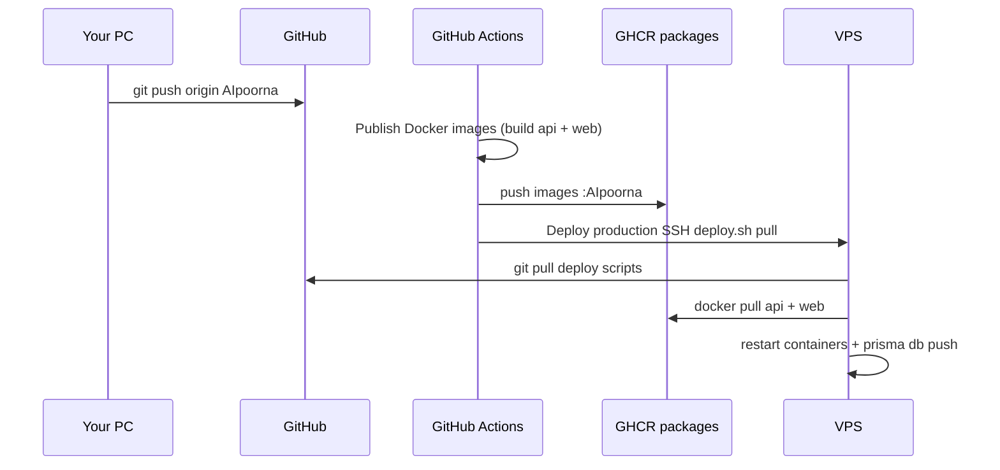

# PoornasreeAI — Deployment guide

Production: **https://poornasree.pydart.com**  
VPS: `168.231.121.19` · repo on server: `/root/poornasree-ai` · branch: `AIpoorna`

---

## Fast deploy (recommended): GitHub push → CI build → VPS pull

**No more `next build` on the small VPS.** Images are built in GitHub Actions; the server only pulls and restarts.



### Daily workflow

```powershell
cd PoornasreeAI
git add .
git commit -m "your message"
git push origin AIpoorna
# Wait ~5–12 min total (CI build + auto deploy). Check Actions tab on GitHub.
```

Manual deploy only if auto-deploy is off or you need to retry:

```powershell
.\scripts\deploy-pull.ps1
.\scripts\deploy-pull.ps1 -Background
```

### One-time setup (do this once)

#### 1. GitHub Actions permissions

- Repo **Settings → Actions → General** → allow workflows to read/write (for `GITHUB_TOKEN` and packages).

#### 2. GHCR package visibility

After the first **Publish Docker images** workflow run:

- Open **GitHub → pydart-hub/PoornasreeAI → Packages**
- Set **poornasree-ai-api** and **poornasree-ai-web** to **Public**  
  (or keep private and log in on the VPS — step 3b)

#### 3. GitHub repository secrets (auto deploy)

**Settings → Secrets and variables → Actions → New repository secret:**

| Secret | Value |
|--------|--------|
| `VPS_HOST` | `168.231.121.19` |
| `VPS_USER` | `root` |
| `VPS_SSH_KEY` | Full private key from `%USERPROFILE%\.ssh\poornasreeAI` (same key `deploy.ps1` uses) |

Workflows:

- [`.github/workflows/publish-images.yml`](.github/workflows/publish-images.yml) — builds and pushes images on every push to `AIpoorna`
- [`.github/workflows/deploy-production.yml`](.github/workflows/deploy-production.yml) — after a successful publish, SSHs to VPS and runs `bash deploy.sh pull`

You can also run **Deploy production (pull images)** manually from the Actions tab (`workflow_dispatch`).

#### 3b. VPS docker login (only if packages are private)

```bash
ssh root@168.231.121.19
echo YOUR_GITHUB_PAT | docker login ghcr.io -u YOUR_GITHUB_USER --password-stdin
```

#### 4. Server `.env` (optional override)

On VPS `/root/poornasree-ai/.env`:

```env
IMAGE_TAG=AIpoorna
API_IMAGE=ghcr.io/pydart-hub/poornasree-ai-api:AIpoorna
WEB_IMAGE=ghcr.io/pydart-hub/poornasree-ai-web:AIpoorna
```

Defaults in [`docker-compose.images.yml`](docker-compose.images.yml) work without this.

---

## Timing comparison

| Method | What runs on VPS | Typical time |
|--------|------------------|--------------|
| **Push + auto pull (recommended)** | `git pull` + `docker pull` + restart + prisma | **~1–3 min** on VPS (+ ~5–10 min CI build) |
| `deploy-pull.ps1` | Same as above (manual trigger) | ~1–3 min |
| `deploy-quick.ps1` | `git pull` + `docker compose build web` | ~8–15 min |
| `deploy-quick.ps1 -Api` | build api on VPS | ~3–6 min |
| `deploy.ps1` (full) | build api + web on VPS | ~15–26 min |

Use **full/quick VPS builds** only when CI/GHCR is broken or you are debugging Dockerfiles locally.

---

## Fallback: build on the VPS (legacy)

```powershell
# UI only
.\scripts\deploy-quick.ps1

# API only
.\scripts\deploy-quick.ps1 -Api

# Both (slow)
.\deploy.ps1 -Background
```

On VPS:

```bash
cd /root/poornasree-ai
bash deploy.sh pull      # fast — pull GHCR images
bash deploy.sh quick     # slow — build web on VPS
bash deploy.sh quick-api # slow — build api on VPS
bash deploy.sh           # full rebuild
```

Logs: `/tmp/deploy.log` · build: `/tmp/compose-build.log`

---

## Do not use

```bash
docker compose down && docker compose up -d --build
```

Current scripts use `up -d --no-deps` so **db, qdrant, ollama, n8n** stay running.

---

## Troubleshooting

| Issue | Action |
|-------|--------|
| **Deploy production** workflow skipped | Add `VPS_HOST`, `VPS_USER`, `VPS_SSH_KEY` secrets |
| Pull deploy `401 Unauthorized` | Make GHCR packages **Public** or `docker login ghcr.io` on VPS |
| Publish images failed | Fix Dockerfile/build in Actions log first |
| Auto deploy OK but old UI | Hard-refresh browser; confirm image tag `AIpoorna` |
| API unhealthy | `ssh root@168.231.121.19` → `docker compose logs api --tail 50` |
| SSH drops during manual deploy | `.\scripts\deploy-pull.ps1 -Background` |

---

## One-time server cache warm-up

After a fresh VPS or wiped Docker cache (only if you still use VPS **build** mode):

```bash
cd /root/poornasree-ai && bash scripts/prewarm-server.sh
```
