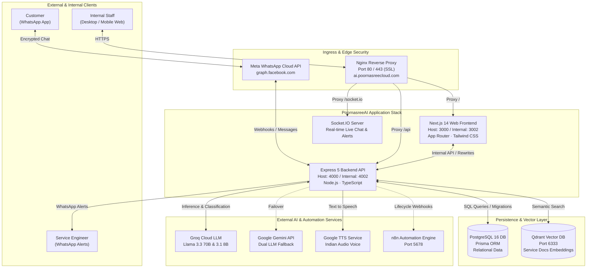
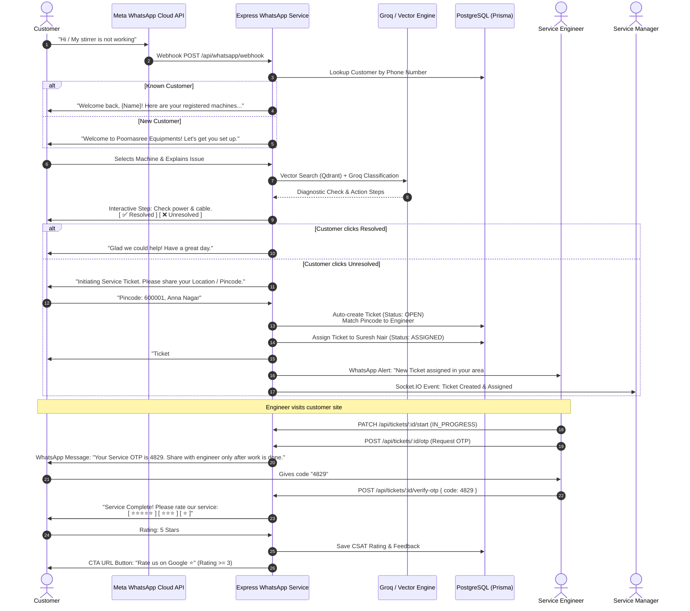
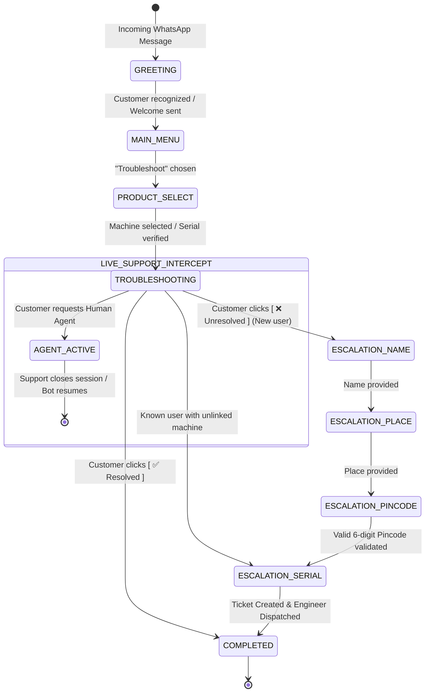
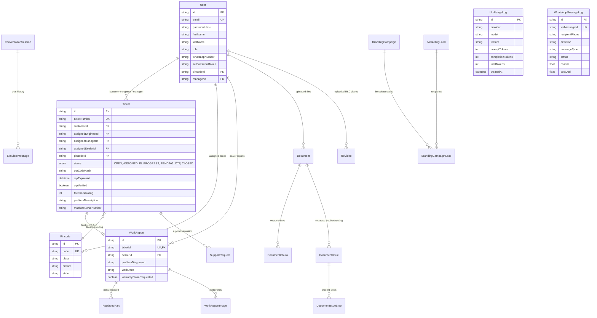
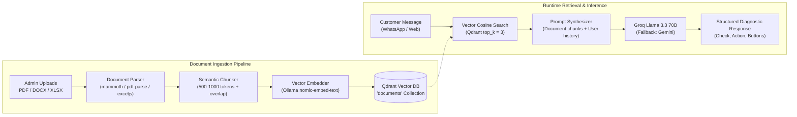

# PoornasreeAI — Master Architecture & Technical Handover Blueprint

> **Platform**: PoornasreeAI  
> **Customer Support Line**: WhatsApp `+91 94009 61291`  
> **Target Audience**: Technical Architects, Engineering Leads, Backend & Frontend Developers, System Administrators  
> **Stack**: Next.js 14 · Express 5 · PostgreSQL 16 · Prisma ORM · Qdrant Vector DB · Groq (Llama 3.3 / 3.1) · Meta WhatsApp Cloud API · Docker Compose · Nginx  

---

## 1. Executive Summary & System Overview

**PoornasreeAI** is an enterprise-grade service management and automated customer support ecosystem built for **Poornasree Equipments** (manufacturers of milk testing and dairy equipment including Lactosure, Lactogrand, Stirrers, and Centrifuges).

The system automates the complete field service lifecycle:
1. **WhatsApp-Driven First-Touch**: Customers interact via WhatsApp without needing a separate mobile app or web login.
2. **AI-Powered Troubleshooting**: Natural language classification, document-grounded RAG (Retrieval-Augmented Generation), and interactive step-by-step diagnostic flows.
3. **Machine Fleet Auto-Discovery**: Automatic identification and matching of customer serial numbers, warranty validation, and customer registration.
4. **Intelligent Service Ticketing & Pincode Routing**: Automatic ticket generation and dispatch to the responsible regional service engineer or dealer based on Indian pincode zones.
5. **On-Site Field Verification via Customer OTP**: Field engineers cannot close tickets arbitrarily; closure requires a real-time OTP verified on the customer's WhatsApp.
6. **Automated Feedback & SLA Logging**: Immediate interactive CSAT star rating collection and SLA compliance metrics.
7. **Unified Multi-Role Operations Web Portal**: Unified role-based access for Super Admins, System Admins, Service Managers, Assistant Managers, Field Engineers, Dealers, Customer Support Agents, Sales, and Marketing teams.

---

## 2. High-Level System Architecture



---

## 3. User Roles, Default Credentials & Access Matrix

All web portals are protected with JWT authentication and accessible via the unified login page at `/login`.

### Seeded Credentials Table

| # | Role Key | Role Name | Default Email | Default Password | Portal Route | Key Capabilities |
|---|---|---|---|---|---|---|
| 1 | `super_admin` | **Super Admin** | `superadmin@poornasree.com` | `SuperAdmin@1234` | `/super-admin` | Runtime settings, LLM API keys, token telemetry, WhatsApp billing, health monitor |
| 2 | `admin` | **System Administrator** | `admin@poornasree.com` | `Admin@1234` | `/admin` | User management, product catalogue, R&D videos, troubleshooting templates, document vector ingestion |
| 3 | `service_manager` | **Service Manager** | `manager@poornasree.com` | `Manager@1234` | `/service-manager` | Geographic routing, ticket dispatch, SLA tracking, engineer workload, drawer inspection |
| 4 | `assistant_service_manager` | **Asst. Service Manager** | `assistant_manager@poornasree.com` | `Assistant@1234` | `/assistant-manager` | Operational ticket monitoring, status verification, ticket escalations |
| 5 | `service_engineer` | **Field Service Engineer** | `engineer1@poornasree.com`<br/>`engineer2@poornasree.com`<br/>`engineer3@poornasree.com` | `Engineer@1234` | `/service` | Field ticket list, issue details, customer calling, OTP verification trigger, work reports, R&D/training video library |
| 6 | `dealer` | **Authorized Dealer** | `dealer@poornasree.com` | `Dealer@1234` | `/dealer` | Customer machine registration, warranty claim requests, dealer work reports |
| 7 | `customer_support` | **Customer Support Agent** | `support@poornasree.com` | `Support@1234` | `/support-dashboard` | Live chat takeover (Bot pause), live agent response, ticket escalation |
| 8 | `customer_service` | **Customer Service** | `customerservice@poornasree.com` | `Service@1234` | `/customer-service` | General customer queries and ticket reviews |
| 9 | `sales` | **Sales Representative** | `sales@poornasree.com` | `Sales@1234` | `/sales` | Equipment inquiries, customer quotes, lead tracking |
| 10 | `marketing` | **Marketing Specialist** | `marketing@poornasree.com` | `Marketing@1234` | `/marketing` | WhatsApp promotional broadcast campaigns, audience filtering |
| 11 | `customer` | **End Customer** | `customer@example.com` | `Customer@123` | `/dashboard` | Machine registry overview (Primary channel is WhatsApp) |

---

## 4. End-to-End User Journeys

### 4.1 Customer WhatsApp Journey (The Core Loop)



---

## 5. Conversational State Machine (FSM)

Customer sessions are managed via `ConversationSession` in PostgreSQL to ensure deterministic conversational states:



---

## 6. Relational Database Schema & Entity Relationships

The relational architecture is defined in `api/prisma/schema.prisma` and backed by PostgreSQL 16:



---

## 7. AI & Multimodal RAG Pipeline



### Voice & Speech Services:
- **Incoming Audio (WhatsApp Voice Notes)**: Audio downloaded via Meta Cloud API, converted if needed, and transcribed using Groq Whisper.
- **Text-to-Speech (`/api/tts`)**: Server-side proxy utilizing `node-gtts` to generate native audio for Indian languages (`en`, `hi`, `mr`, `bn`, `te`).

---

## 8. Deployment & DevOps Architecture

### Multi-Container Topology (`docker-compose.yml`)

```
                  ┌───────────────────────────────────────────────┐
                  │                 Host Machine                  │
                  │                                               │
                  │   Nginx Reverse Proxy (Host :80 / :443 SSL)   │
                  └───────┬───────────────────────────────┬───────┘
                          │ :3000                         │ :4000
                          ▼                               ▼
    ┌─────────────────────────────────────────────────────────────┐
    │                     Docker Internal Bridge                  │
    │                                                             │
    │   ┌────────────────┐      ┌─────────────────────────────┐   │
    │   │  web (Next.js) │ <--> │  api (Express 5 + Prisma)   │   │
    │   └────────────────┘      └──────────────┬──────────────┘   │
    │                                          │                  │
    │             ┌────────────────────────────┼──────────────┐   │
    │             │ :5432                      │ :6333        │   │
    │             ▼                            ▼              │   │
    │   ┌────────────────────┐      ┌─────────────────────┐   │   │
    │   │ db (PostgreSQL 16) │      │ qdrant (Vector DB)  │   │   │
    │   └────────────────────┘      └─────────────────────┘   │   │
    │                                          │              │   │
    │                                          │ :11434       │   │
    │                                          ▼              │   │
    │                               ┌─────────────────────┐   │   │
    │                               │  ollama (Embeddings)│   │   │
    │                               └─────────────────────┘   │   │
    │                                                         │   │
    │   ┌─────────────────────────────────────────────────┐   │   │
    │   │  n8n (Workflow Automation on Host :5678)        │   │   │
    │   └─────────────────────────────────────────────────┘   │   │
    └─────────────────────────────────────────────────────────────┘
```

### Port Mapping Summary

| Service | Internal Port | Host Port | Exposure | Description |
|---|---|---|---|---|
| `web` | `3000` | `127.0.0.1:3000` (or `3002`) | Proxied by Nginx | Next.js frontend UI |
| `api` | `4000` | `127.0.0.1:4000` (or `4002`) | Proxied by Nginx | Express backend REST & Socket.IO |
| `db` | `5432` | None (Internal) | Docker Network | PostgreSQL 16 database |
| `qdrant` | `6333` | None (Internal) | Docker Network | Vector search database |
| `ollama` | `11434` | None (Internal) | Docker Network | Local embeddings / LLM container |
| `n8n` | `5678` | `127.0.0.1:5678` (or `5679`) | Direct / Nginx | Workflow automation |

---

## 9. Developer & Operational Playbook

### 9.1 Fresh Installation & Local Bootstrap

```bash
# 1. Clone repository
git clone <repository_url>
cd PoornasreeAI

# 2. Configure Environment Files
cp .env.example .env
cp api/.env.example api/.env

# 3. Install dependencies
npm install
cd api && npm install && cd ..

# 4. Initialize Database & Run Migrations
cd api
npx prisma migrate deploy
npx prisma db seed
cd ..

# 5. Launch Full Stack in Development Mode
npm run dev
```

### 9.2 Production Deployment on VPS

Follow the detailed instructions in **[docs/DEPLOY-RUNBOOK.md](DEPLOY-RUNBOOK.md)**:

```bash
# On Remote Linux VPS:
cd /var/www/PoornasreeAI
git pull origin main
./deploy.sh quick-api   # To rebuild and restart backend only
./deploy.sh quick       # To rebuild and restart frontend only
./deploy.sh full        # Full restart including migrations
```

### 9.3 Resetting Super Admin Password

If the super admin credentials are ever lost or locked:
```bash
cd api
npx ts-node --transpile-only src/scripts/ensure-super-admin.ts
```
This restores `superadmin@poornasree.com` with `SuperAdmin@1234`.

---

## 10. Security & Compliance Checklist

- **Secrets Handling**: All production secrets are kept in `.env` and excluded from git.
- **Dynamic Configuration**: Super Admin can override API keys directly in the database with AES-GCM encryption (`SystemSetting` table).
- **OTP Tamper Prevention**: OTP codes are stored as SHA-256 hashes (`otpCodeHash`) with 15-minute expirations and a maximum attempt rate limiter.
- **Role Guards**: Backend API routes strictly enforce role authorization via `protect` and `requireRole(...)` middleware.
- **CORS & Proxying**: Direct browser-to-backend access is restricted; all external traffic routes cleanly through Next.js proxy rewrites or Nginx.
